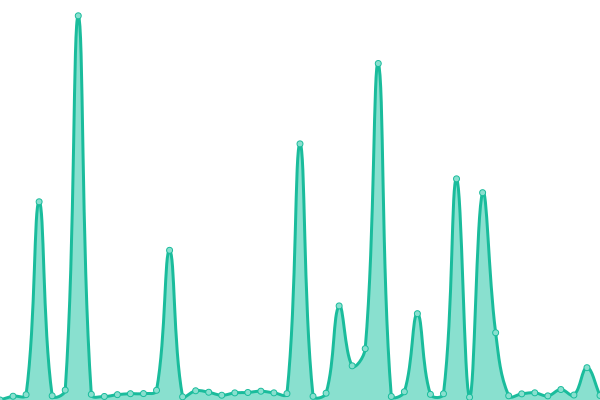

# [📈 Live Status](https://status.mon.ibaguette.com): <!--live status--> **🟩 All systems operational**

This repository contains the open-source uptime monitor and status page for [Draggie](ibaguette.com), powered by [Upptime](https://github.com/upptime/upptime).

With [Upptime](https://upptime.js.org), you can get your own unlimited and free uptime monitor and status page, powered entirely by a GitHub repository. We use [Issues](https://github.com/Draggie306/UptimeStatus/issues) as incident reports, [Actions](https://github.com/Draggie306/UptimeStatus/actions) as uptime monitors, and [Pages](https://status.mon.ibaguette.com) for the status page.

<!--start: status pages-->
<!-- This summary is generated by Upptime (https://github.com/upptime/upptime) -->
<!-- Do not edit this manually, your changes will be overwritten -->
<!-- prettier-ignore -->
| URL | Status | History | Response Time | Uptime |
| --- | ------ | ------- | ------------- | ------ |
|  [iBaguetteMain](https://www.ibaguette.com) | 🟩 Up | [i-baguette-main.yml](https://github.com/Draggie306/UptimeStatus/commits/HEAD/history/i-baguette-main.yml) | 

 735ms
     
 | 

<a href="https://status.mon.ibaguette.com/history/i-baguette-main">100.00%</a>
    

|  [BaguetteBrigadersHelper](https://repl1.ibaguette.com) | 🟩 Up | [baguette-brigaders-helper.yml](https://github.com/Draggie306/UptimeStatus/commits/HEAD/history/baguette-brigaders-helper.yml) | 

 676ms
     
 | 

<a href="https://status.mon.ibaguette.com/history/baguette-brigaders-helper">98.85%</a>
    

<!--end: status pages-->

[**Visit our status website →**](https://status.mon.ibaguette.com)

## 📄 License

- Powered by: [Upptime](https://github.com/upptime/upptime)
- Code: [MIT](./LICENSE) © [Draggie](ibaguette.com)
- Data in the `./history` directory: [Open Database License](https://opendatacommons.org/licenses/odbl/1-0/)
