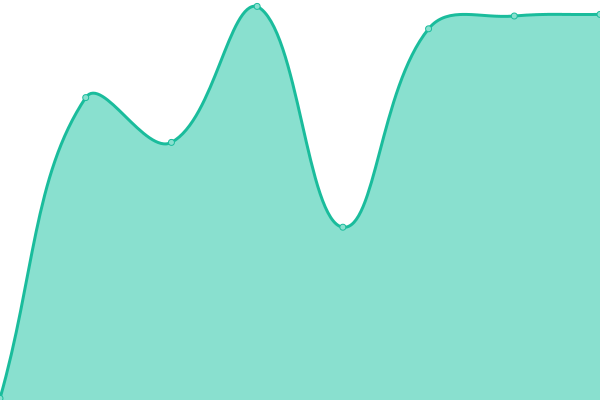
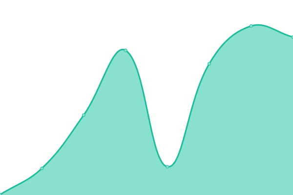
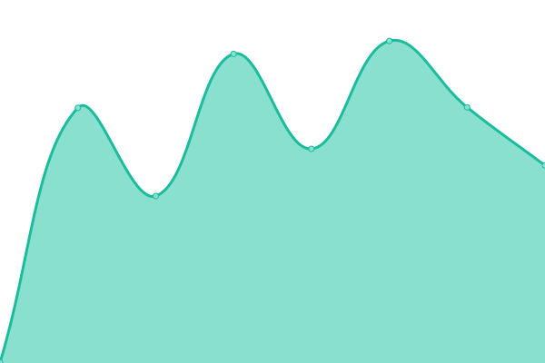
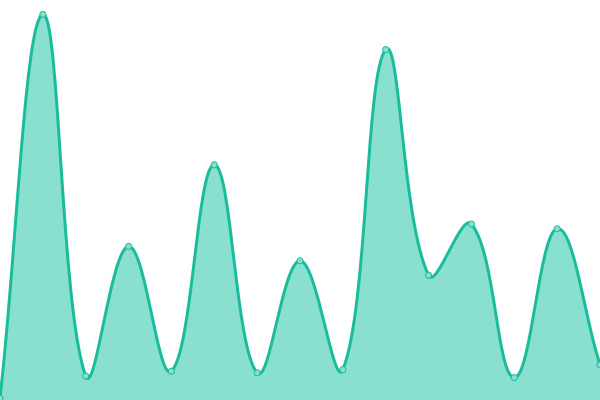

# [📈 Live Status](https://status.mon.ibaguette.com): <!--live status--> **🟧 Partial outage**

This repository contains the open-source uptime monitor and status page for [Draggie](ibaguette.com), powered by [Upptime](https://github.com/upptime/upptime).

With [Upptime](https://upptime.js.org), you can get your own unlimited and free uptime monitor and status page, powered entirely by a GitHub repository. We use [Issues](https://github.com/Draggie306/UptimeStatus/issues) as incident reports, [Actions](https://github.com/Draggie306/UptimeStatus/actions) as uptime monitors, and [Pages](https://status.mon.ibaguette.com) for the status page.

<!--start: status pages-->
<!-- This summary is generated by Upptime (https://github.com/upptime/upptime) -->
<!-- Do not edit this manually, your changes will be overwritten -->
<!-- prettier-ignore -->
| URL | Status | History | Response Time | Uptime |
| --- | ------ | ------- | ------------- | ------ |
|  [iBaguette.com Main Site](https://www.ibaguette.com) | 🟩 Up | [i-baguette-com-main-site.yml](https://github.com/Draggie306/UptimeStatus/commits/HEAD/history/i-baguette-com-main-site.yml) | 

 173ms
     
 | 

<a href="https://status.ibaguette.com/history/i-baguette-com-main-site">98.38%</a>
    

|  [iBaguette.com Cheat Sheets](https://ibaguette.com/cheatsheets) | 🟥 Down | [i-baguette-com-cheat-sheets.yml](https://github.com/Draggie306/UptimeStatus/commits/HEAD/history/i-baguette-com-cheat-sheets.yml) | 

 180ms
     
 | 

<a href="https://status.ibaguette.com/history/i-baguette-com-cheat-sheets">97.92%</a>
    

|  [iBaguette Stories](https://stories.ibaguette.com) | 🟩 Up | [i-baguette-stories.yml](https://github.com/Draggie306/UptimeStatus/commits/HEAD/history/i-baguette-stories.yml) | 

 210ms
     
 | 

<a href="https://status.ibaguette.com/history/i-baguette-stories">98.13%</a>
    

|  [iBaguette Study](https://study.ibaguette.com) | 🟥 Down | [i-baguette-study.yml](https://github.com/Draggie306/UptimeStatus/commits/HEAD/history/i-baguette-study.yml) | 

 0ms
     
 | 

<a href="https://status.ibaguette.com/history/i-baguette-study">0.00%</a>
    

|  [Baguette Brigade Helper bot](https://brigaders-stats.ibaguette.com) | 🟥 Down | [baguette-brigade-helper-bot.yml](https://github.com/Draggie306/UptimeStatus/commits/HEAD/history/baguette-brigade-helper-bot.yml) | 

 0ms
     
 | 

<a href="https://status.ibaguette.com/history/baguette-brigade-helper-bot">0.00%</a>
    

|  [Draggie Games: Website](https://alpha.draggiegames.com) | 🟩 Up | [draggie-games-website.yml](https://github.com/Draggie306/UptimeStatus/commits/HEAD/history/draggie-games-website.yml) | 

 183ms
     
 | 

<a href="https://status.ibaguette.com/history/draggie-games-website">98.38%</a>
    

|  [Draggie Games: Authentication services](https://client.draggie.games) | 🟩 Up | [draggie-games-authentication-services.yml](https://github.com/Draggie306/UptimeStatus/commits/HEAD/history/draggie-games-authentication-services.yml) | 

 770ms
     
 | 

<a href="https://status.ibaguette.com/history/draggie-games-authentication-services">97.98%</a>
    

|  [Draggie Games: Game download CDN](https://draggiegames-content-library-euwest0002-prod.draggie.games/tools_test.txt) | 🟩 Up | [draggie-games-game-download-cdn.yml](https://github.com/Draggie306/UptimeStatus/commits/HEAD/history/draggie-games-game-download-cdn.yml) | 

 282ms
     
 | 

<a href="https://status.ibaguette.com/history/draggie-games-game-download-cdn">98.21%</a>
    

|  [Draggie Games: On-demand content](https://assets.draggie.games/tools_test.txt) | 🟩 Up | [draggie-games-on-demand-content.yml](https://github.com/Draggie306/UptimeStatus/commits/HEAD/history/draggie-games-on-demand-content.yml) | 

 380ms
     
 | 

<a href="https://status.ibaguette.com/history/draggie-games-on-demand-content">98.18%</a>
    

|  [geog.uk: Homepage](https://geog.uk) | 🟥 Down | [geog-uk-homepage.yml](https://github.com/Draggie306/UptimeStatus/commits/HEAD/history/geog-uk-homepage.yml) | 

 88ms
     
 | 

<a href="https://status.ibaguette.com/history/geog-uk-homepage">0.00%</a>
    

|  [geog.uk: Homepage](https://geog.uk) | 🟥 Down | [geog-uk-homepage.yml](https://github.com/Draggie306/UptimeStatus/commits/HEAD/history/geog-uk-homepage.yml) | 

 88ms
     
 | 

<a href="https://status.ibaguette.com/history/geog-uk-homepage">0.00%</a>
    

|  [oling.dev: Homepage](https://oling.dev) | 🟥 Down | [oling-dev-homepage.yml](https://github.com/Draggie306/UptimeStatus/commits/HEAD/history/oling-dev-homepage.yml) | 

 202ms
     
 | 

<a href="https://status.ibaguette.com/history/oling-dev-homepage">0.00%</a>
    

<!--end: status pages-->

[**Visit our status website →**](https://status.mon.ibaguette.com)

## 📄 License

- Powered by: [Upptime](https://github.com/upptime/upptime)
- Code: [MIT](./LICENSE) © [Draggie](ibaguette.com)
- Data in the `./history` directory: [Open Database License](https://opendatacommons.org/licenses/odbl/1-0/)
